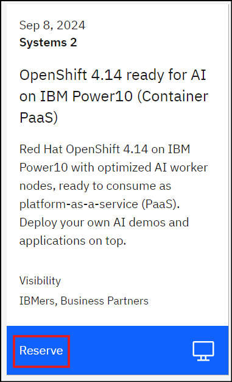

# Lab Setup

## Provisioning the environment

For the hands-on labs, we will be using the OpenShift on Power10 on-prem environment which is optimized for AI workloads and hosted on IBM TechZone.

Follow the steps below:

1. Open [this](https://techzone.ibm.com/collection/generative-ai-demos-on-ibm-power/environments){target="_blank"} TechZone collection and provision the environment named "OpenShift 4.14 ready for AI on IBM Power10 (Container PaaS)" by clicking on **Reserve** and submitting the resulting form (select **Education** as purpose)
   
   
2. Watch your email for updates from TechZone and wait for your environment to be provisioned.   
3. Once provisioned, go to [my reservations](https://techzone.ibm.com/my/reservations){target="_blank"} page to ensure its in "Ready" state.

     

## Accessing the environment

1. As this is an on-prem environment, verify you are connected to the IBM Virtual Private Network (VPN) to access the environment. Refer to [this](https://github.com/IBM/itz-support-public/blob/main/IBM-On-premise/IBM-On-premise-Runbooks/configure-vpn.md){target="_blank"} link for more details.
2. In TechZone, open the [My Reservations](https://techzone.ibm.com/my/reservations){target="_blank"} page.
3. Click on your reservation, which will open up the details page.
4. Scroll to the "Reservation Details" section of the page which has information on how to connect to OpenShift console
   

### Accessing OpenShift console

1. In the "Reservation Details" section of the TechZone environment details page, click on the OpenShift console link
2. This will open up a new browser tab/window and opens up the OpenShift console login page   
      - If you encounter any security exception, navigate to the bottom of the browser page, acccept the exception under Advanced and continue. This is ok as we are in a lab/demo environment and using self-signed certificates.
4. On the OpenShift console page, select the **htpasswd** login option.
5. Use Username: `cecuser` and Password: `<as provided in the TechZone Reservation Details page>`
      - TIP: Click on the copy icon provided under 'User Password' in the Reservation Details page to copy the password and paste it in the OpenShift console window

     
     

7. You have successfully logged into the OpenShift cluster using the console. You should be able to see the dashboard (or the page you were on before logging off) of your OpenShift console. You should land in **Administrator** profile (or **Developer** profile if that was the last profile you were in when you logged off).
8. **TIP**: Its a good idea to have 2 browser windows (or tabs per your preference) for OpenShift console access - one with Administrator profile and another with Developer profile because in the hands-on labs we will be needing to switch between these profiles and its easier and efficient to do so with 2 browser windows.

     - To do so, copy the URL from the browser address bar, open a new browser window (or tab) and paste the URL there. It should open up one more OpenShift console in the new window (or tab). In the new window/tab, switch to the Developer profile (also known as Persona) by going to the top left corner and clicking on **Administrator** and selecting **Developer** (or vice-versa) in the drop down menu. In short, ensure you have 2 browser windows, one each with Administrator and Developer profile (also known as Persona) and we will call this OpenShift Administrator console and Developer console respectively.

        <video style="width:100%" muted="true" autoplay="true" loop="true" controls="" alt="type:video">
           <source src="https://github.com/user-attachments/assets/a622a195-00a6-4950-b2e5-686b04fa3401" type="video/mp4">
        </video>
     
### Re-authenticating for console

!!! note "RE-AUTHENTICATING in case you lose console access"
   
    In case you lose access to the OpenShift cluster and need to re-login to the console, which is possible in case your reservation expires and/or your console authentication timed-out, please follow the above steps again to re-login to your OpenShift console

### Accessing OpenShift `oc` CLI

1. Go back to the "Reservation Details" section of the TechZone environment details page.
2. Open your terminal window and use SSH utility to connect to the Bastion node of OpenShift cluster.
      - `ssh -l cecuser <your bastion hostname/IP as provided in Reservation Details section>`
      - If `ssh` gives any warning, type `yes` and continue
      - When prompted for password, copy the password from Reservation Details page by clicking on the copy icon and pasting it in the ssh terminal window
3. You have logged in successfully to the bastion node of your OpenShift cluster.
      - Keep this terminal window always open as you will be using it frequently to run CLI commands.
5. `oc` CLI is pre-installed on the bastion node and must be working already. You can check by running `oc version` command.
      - Ignore the error part of the `oc version` for now. Its as expected since you have not yet logged into the cluster from the CLI.
     
      
      
      

### Logging in to OpenShift Cluster using `oc` CLI
Let's login to the OpenShift cluster via the `oc` CLI. This is needed as we will execute some CLI commands as part of the lab steps.

1. In the OpenShift console, top right section click on `cecuser` and select `Copy login command` option.
   
     
   
3. A new browser window (or tab, depending on your browser setting) opens up.
      - If you encounter any security exception, navigate to the bottom of the browser page, acccept the exception under Advanced and continue. This is ok as we are in a lab/demo environment and using self-signed certificates.
4. You will be presented with another login screen. Click **htpasswd** option
   
5. Use Username: `cecuser` and Password: `<as provided in the TechZone Reservation Details page>`
      - TIP: Click on the copy icon provided under 'User Password' in the Reservation Details page to copy the password and paste it in the OpenShift console window.
6. Click **Display token**
   
     
   
7. Copy the `oc login --token=...` CLI and paste it in the bastion node terminal window.
     
     
8. You have successfully logged into the OpenShift cluster using the `oc` CLI.
9. In case you lose access to the `oc` CLI, you will get an error as below, in which case you need to re-authenticate. 
   Refer to the call-out on how to re-authenticate.

     
   
### Re-authenticating for CLI access

!!! note "RE-AUTHENTICATING in case you lose CLI access"
      
    In case you lose access to the OpenShift cluster and need to re-authenticate using the CLI, which is possible in case your reservation expires and/or your CLI window terminated for some reason, please follow the above steps again to get back your `oc` CLI authenticated to the OpenShift cluster

### Summary
Efforts are made to keep the lab instructions simple and easy to follow to cater to audience of all skill levels.
We strive to use OpenShift console as much possible, but in some scenarios OpenShift console doesn't yet support some functionality in which case we switch to the `oc` CLI. Hence this lab will use OpenShift console and `oc` CLI both as necessary.

